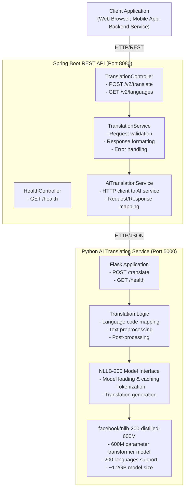
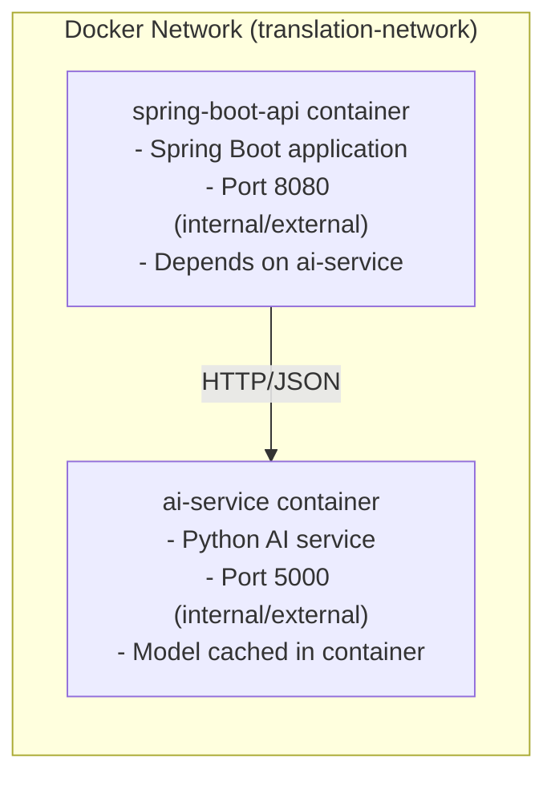

# Architecture Overview

## System Architecture



## Component Details

### Spring Boot REST API

**Technology Stack:**
- Java 17
- Spring Boot 3.2.1
- Maven 3.9.6
- Lombok for reduced boilerplate

**Key Components:**

1. **Controllers**
   - `TranslationController`: Handles translation requests
   - `HealthController`: Health check endpoint

2. **Services**
   - `TranslationService`: Business logic for translations
   - `AiTranslationService`: Communication with AI service

3. **Models**
   - Request/Response DTOs
   - Language entities

4. **Configuration**
   - `WebConfig`: CORS configuration
   - `GlobalExceptionHandler`: Error handling

**Responsibilities:**
- Validate incoming requests
- Format responses to match DeepL API
- Handle multiple texts in batch
- Manage communication with AI service
- Error handling and logging

### Python AI Translation Service

**Technology Stack:**
- Python 3.11
- Flask 3.0.0
- Transformers 4.48.0 (security patched)
- PyTorch 2.6.0 (security patched)
- Gunicorn 22.0.0 (security patched)
- Sentencepiece 0.2.1 (security patched)
- Protobuf 4.25.8 (security patched)

**Key Components:**

1. **Flask Application**
   - REST endpoints
   - Request handling
   - Response serialization

2. **Model Management**
   - Model loading at startup
   - In-memory caching
   - Resource optimization

3. **Translation Logic**
   - Language code mapping (DeepL → NLLB)
   - Text tokenization
   - Translation generation
   - Result decoding

**Responsibilities:**
- Load and cache the NLLB model
- Perform actual translation using AI
- Manage model resources
- Handle tokenization and decoding

### NLLB-200 Model

**About:**
- Developed by Meta AI Research
- "No Language Left Behind" - 200 languages
- Default version: 1.3B parameters (higher quality, slower)
- Other versions available: 600M distilled, 3.3B parameters

**Language Support:**
- Covers major world languages
- Script support: Latin, Cyrillic, Arabic, CJK, etc.
- Handles code-switching and informal text

**Performance:**
- First load: ~30-60 seconds
- Inference time: ~1-3 seconds per text
- Memory footprint: ~2-3GB RAM

## Data Flow

### Translation Request Flow

1. **Client sends request** → Spring Boot API
   ```json
   POST /v2/translate
   {
     "text": ["Hello World"],
     "target_lang": "DE"
   }
   ```

2. **Spring Boot validates request**
   - Checks required fields
   - Validates language codes
   - Splits multiple texts if needed

3. **Spring Boot forwards to AI service**
   ```json
   POST /translate
   {
     "text": "Hello World",
     "sourceLang": null,
     "targetLang": "DE"
   }
   ```

4. **AI service processes**
   - Maps language codes (DE → deu_Latn)
   - Tokenizes input text
   - Runs through NLLB model
   - Decodes output tokens

5. **AI service returns translation**
   ```json
   {
     "translatedText": "Hallo Welt",
     "detectedSourceLanguage": "ENG"
   }
   ```

6. **Spring Boot formats response**
   ```json
   {
     "translations": [{
       "detected_source_language": "EN",
       "text": "Hallo Welt"
     }]
   }
   ```

7. **Client receives response**

## Docker Architecture

### Container Setup



### Build Process

1. **AI Service Build**
   - Base: python:3.11-slim
   - Install dependencies
   - Download NLLB model (build time)
   - Copy application code
   - Configure Gunicorn

2. **Spring Boot Build**
   - Build stage: maven:3.9.6-eclipse-temurin-17
   - Compile Java code
   - Package as JAR
   - Runtime stage: eclipse-temurin:17-jre-alpine
   - Copy JAR and run

### Health Checks

- AI service health check every 30s
- Spring Boot waits for AI service to be healthy
- Startup period: 120s for model loading

## Scalability Considerations

### Current Setup
- Single worker process
- Sequential request processing
- Suitable for development and low-traffic production

### Scaling Options

1. **Horizontal Scaling**
   - Deploy multiple AI service replicas
   - Load balancer in front
   - Shared model cache (if using external storage)

2. **Vertical Scaling**
   - Increase container memory
   - Use larger NLLB model variants
   - More CPU cores for parallel processing

3. **Performance Optimization**
   - Model quantization (INT8)
   - Batch processing
   - GPU acceleration (configurable via `USE_CUDA` with CPU fallback)
   - Model serving frameworks (TorchServe, ONNX)

## Security Considerations

### Current Implementation
- No authentication
- CORS enabled for all origins
- No rate limiting
- No data encryption

### Production Recommendations
1. Add API key authentication
2. Configure specific CORS origins
3. Implement rate limiting
4. Use HTTPS/TLS
5. Add request validation and sanitization
6. Monitor and log all requests
7. Implement IP whitelisting if needed

## Monitoring

### Health Endpoints
- `/health` - API health check
- `/translate` - AI service health check

### Logging
- Spring Boot: INFO level
- Python: INFO level
- Docker Compose: Container logs

### Metrics to Monitor
- Request count
- Response time
- Error rate
- Memory usage
- Model inference time
- Queue depth (if implemented)

## Future Enhancements

1. **Features**
   - Document translation
   - Formality support
   - Glossary support
   - Translation memory
   - Language detection endpoint

2. **Performance**
   - Request batching
   - Async processing
   - GPU support
   - Model optimization

3. **Infrastructure**
   - Kubernetes deployment
   - Redis for caching
   - Database for translation history
   - Message queue for async processing

4. **Observability**
   - Prometheus metrics
   - Grafana dashboards
   - Distributed tracing
   - Error tracking (Sentry)
